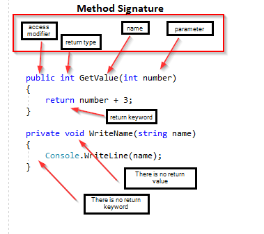

# Methoden

Was sind Methoden? Warum soll man Methoden benutzen?

---

<!-- .slide: class="left" -->
## Methoden

**Warum Methoden verwenden?**

Um Code wiederzuverwenden und das Programm klarer zu strukturieren. Der Code wird einmal definiert und kann wiederverwendet werden.

* Methoden können definierte Parameter entgegennehmen.
* Eine Methode kann nur einen oder auch keinen (`void`) Wert zurückgeben.
* Methoden werden innerhalb der Klasse definiert.
* Methoden gehören immer zu einer Klasse.
* Eine Klasse kann mehrere Methoden enthalten, wobei die Methoden in beliebiger Reihenfolge deklariert werden können.
* Mit Methoden werden Aktionen ausgeführt, Daten verändert oder ausgegeben.
* Der Codeblock einer Methode wird nur ausgeführt, wenn die Methode aufgerufen wird.

Mehr zum Thema [Methoden](https://docs.microsoft.com/de-de/dotnet/csharp/methods)

Note: In C# wird nur von Methoden gesprochen. Keine Unterscheidung wie in C von Funktion (mit Rückgabewert) oder Prozedur (void).

---

<!-- .slide: class="left" -->
## Methodendefinition

Methoden werden innerhalb einer Klasse definiert. Mit:

**Zugriffsebene, Rückgabewert, Name und Parameter**

```csharp []
class Program
{
    public static void MyMethod() 
    {
        // Code to be executed
    }
}
```

Note: 
* `MyMethod()` Name der Methode
* `static` bedeutet, dass die Methode zur Klasse Program gehört und nicht zu einem Objekt der Klasse Program. 
* `void` Die Methode gibt keinen Wert zurück
* Pascal-Schreibweise (jeden Anfangsbuchstaben eines Wortes groß)

---

<!-- .slide: class="left" -->
## Methodenaufruf und Methodenparameter

Um an eine Methode Werte mitzugeben werden Parameter benötigt. Es können ein oder mehrere Parameter definiert werden.

Der Aufruf der Methode muss aber genau die gleiche Anzahl an Parametern beinhalten wie die Methodendefinition Parameter hat.

```csharp []
static void MyMethod(string name) 
{
    Console.WriteLine($"Schüler: {name}");
}

static void Main(string[] args)
{
    MyMethod("Andreas");
    MyMethod("Lea");
    MyMethod("Ben");
}
```

Note: Methode kann mehrfach aufgerufen werden.

---

<!-- .slide: class="left" -->
### Rückgabewerte

Das Schlüsselwort `void`, das in den obigen Beispielen verwendet wird, gibt an, dass die Methode keinen Wert zurückgeben soll. 

Wenn die Methode einen Wert zurückgeben soll, können Sie anstelle von `void` einen Datentyp (z. B. `int` oder `double`) verwenden und innerhalb der Methode das Schlüsselwort `return` verwenden:

```csharp []
static int MyMethod(int x) 
{
    return 5 + x;
}
```

---

<!-- .slide: class="left" -->
### Beispiel

```csharp []
using System;

namespace Programmaufbau;

class Program
{
    static void Main(string[] args)
    {
        // Wert direkt für die Ausgabe verwenden.
        Console.WriteLine("Ergebnis: " + Addition(12, 10));

        // Wert in einer Variable speichern
        int result = Addition(10, 10);
    }

    // Neue Methode welche einen int-Wert zurückliefert und zwei int-Werte als Parameter entgegen nimmt
    private static int Addition(int zahl1, int zahl2)
    {
        // Wert welcher zurück gegeben werden soll
        return zahl1 + zahl2;
    }
}
```

---

<!-- .slide: class="left" -->
## Methodendefinition



Note: **ÜBUNG** BMI

---

<!-- .slide: class="left" -->
## Überladen (Overloading)

Von **Überladen** spricht man, wenn mehrere Methoden den gleichen Namen haben,
aber eine unterschiedliche Anzahl an Parameter oder unterschiedliche
Parametertypen besitzen.

```csharp []
void Multiplikation(double value) {};
void Multiplikation(int value) {};
void Multiplikation(int value, int result) {};
void Multiplikation(float valueA, float valueB, int result) {};

// Fehler, nicht möglich
float Multiplikation(float valueA, float valueB, int result) {}; 
```

Note:
Dies wäre möglich da andere Parametertypen:
`int Multiplikation(int valueA, int valueB, int result) {};` 

---

<!-- .slide: class="left" -->
## Optionale Parameter

Ein optionaler Parameter hat einen Standardwert. Dieser muss immer am Ende der Parameterliste, nach allen obligatorischen Parametern, stehen.
Die Methode, die optionale Parameter hat, kann ohne diese Parameter aufgerufen werden. Sie können aber auch angegeben werden. Dann werden die Standardwerte überschrieben.

```csharp []
public static void MethodWithOptParams(int first, int second = 10)
{
    Console.WriteLine(first + second);
}
MethodWithOptParams(20); // Ergebnis ist 30
MethodWithOptParams(20, 35); // Ergebnis ist 55
```

Note: 
Es werden immer die Methoden bevorzugt die keine optionalen Parameter haben.
In IntelliSense werden optionale Parameter in eckigen Klammern angezeigt.

**VS** Methoden

---

<!-- .slide: class="left" -->
## Benannte Parameter

Benannte Parameter können bei jedem Methodenaufruf verwendet werden. Hierbei wird vor dem Wert auch der Name des Parameters angegeben. Dadurch können die Parameter in beliebiger Reihenfolge angegeben werden.

```csharp []
public static void MethodForTest(int xPosition, int yPostion, int size)
{
    // Code
}

MethodForTest(1, 2, 3);
MethodForTest(xPosition: 1, yPosition: 2, size: 3);
MethodForTest(size: 3, yPosition: 2, xPosition: 1);
```

Benannte Parameter müssen immer am Ende des Methodenaufrufs stehen.

```csharp []
MethodForTest(xPosition: 1, yPosition: 2, 3); // fehler
```

Note:
Kann bei vielen Methoden-Parametern zu einer besseren Lesbarkeit beitragen.

Außerdem können sie zur eindeutigen Identifizierung eines optionalen Parameters verwendet werden, wenn es mehr als einen Parameter desselben Typs gibt:
```csharp
MarkAsDone(int first, int second=0, int third=0) {}
MarkAsDone(1, third: 3);
```
**ÜBUNG** Palindrom