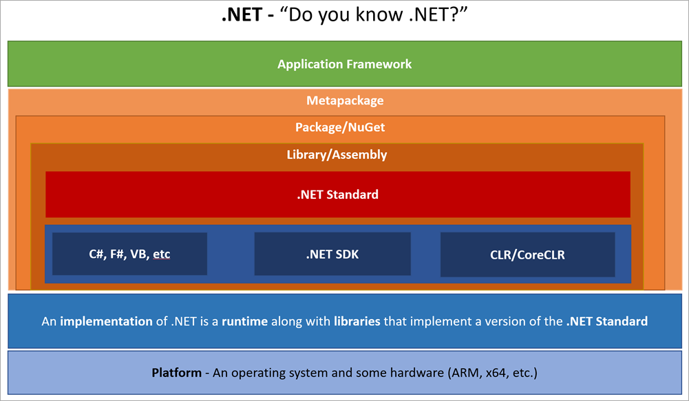
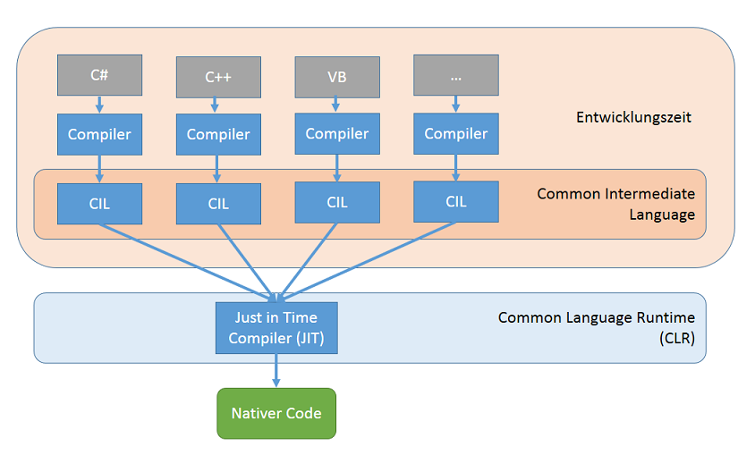
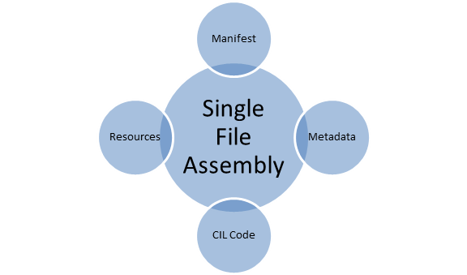

# .NET Framework

Was ist .NET


<!-- .slide: class="left" -->
## Was ist das .NET Framework

* Das .NET Framework bezeichnet eine von Microsoft entwickelte Plattform zur Entwicklung und Ausführung von Anwendungen für das Web, Windows und Microsoft Azure.

* .NET ist plattformunabhängig.

* Beim .NET Framework handelt es sich um eine offene Technologie.

* Es unterstützt eine Vielzahl an Programmiersprachen (C#, F# and Visual Basic).

* Für die Entwicklung von .NET Anwendungen wird von Microsoft Visual Studio empfohlen.

Note: Plattformunabhängig = Unterschied in Architektur, Prozessor und OS. Wird durch die Laufzeitumgebung (CLR) gewährleistet.


<!-- .slide: class="left" -->
## .NET Core

* Cross-Plattform und OpenSource Implementierung von .NET

* Zukunft von .NET


<!-- .slide: class="left" -->
## .NET Architektur




<!-- .slide: class="left" -->
## Ablauf der Entwicklung eines .NET Programms

* Jede der unterstützten Hochsprachen wird von .NET zunächst in die Zwischensprache **CIL**(Common Intermediate Language) übersetzt (früher Microsoft Intermediate Language (MSIL)).

* Ein kompiliertes Programm besteht aus Anweisungen in der Sprache **CIL**.

* Der CIL Code wird von einem sogenannten **Just-in-Time Compiler** (JIT-Compiler) in die Maschinensprache des jeweiligen Prozessors übersetzt, ähnlich wie bei Java.

* Das Programm wird dann von der Laufzeitumgebung Common Language Runtime (CLR) ausgeführt.


<!-- .slide: class="left" -->
## Ablauf der Entwicklung eines .NET Programms



Note: CLI (systemunabhängig) = Programmbefehle als Bytefolge

Just in Time: Auf Zielsystem zur Laufzeit. Übersetzt Bytecode in Maschinensprache (Maschinencode) des jeweiligen Prozessors.


<!-- .slide: class="left" -->
## C\# Code zu CIL Code

C#

```csharp
class MainClass
{
    public static void Main()
    {
        System.Console.WriteLine("Hallo IHK!");
    }
}
```

CIL

```csharp
.assembly HalloWelt { }
.assembly extern mscorlib { }
.method public static void Main() cil managed
{
    .entrypoint
    .maxstack 1
    ldstr "Hallo IHK!"
    call void [mscorlib]System.Console::WriteLine(string)
    ret
}
```


<!-- .slide: class="left" -->
## Assemblierung

* Der Compiler fügt mehrere CIL Modul- und Objektdateien zu einer **Assembly** zusammen. Dies ist die kleinste, verteilbare Einheit.

* Im einfachsten Fall handelt es sich dabei um eine einzelne Anwendung (EXE-Datei oder um eine Klassenbibliothek (DLL).

* Eine Assembly kann aber auch aus mehreren DLL-Dateien und weiteren Ressourcen Bildern bestehen.

* Jede Assembly enthält ein **Manifest** mit Beschreibungsdaten (Metadaten) über die darin definierten Typen, über importierte Typen, andere verwaltete Assemblies sowie Versionsinformationen.

* Die Definition einer Assemblierung kann in einer einzigen Datei enthalten oder über mehrere Dateien verteilt sein.

Note: Solution -> Eigenschaften -> Assemblyinformationen


<!-- .slide: class="left" -->
## Assemblierung



Note: Mögliche Komponenten einer Assembly

Auch Multi File Assembly möglich