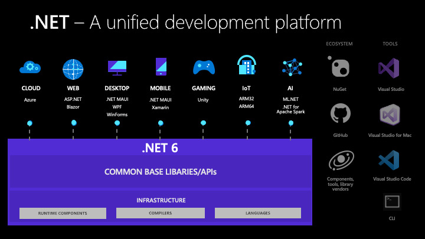

# Microsoft .NET

Was ist Microsoft .NET

---

<!-- .slide: class="left" -->
## .NET historische Entwicklung (.NET Framework zu .NET)


---

<!-- .slide: class="left" -->
## .NET Framework

* Das .NET Framework bezeichnet eine von Microsoft entwickelte Plattform zur Entwicklung und Ausführung von Anwendungen für Windows und das Web.

* Windows only

* Beim .NET Framework handelt es sich um geschlossenen Quellcode.

* Es unterstützt eine Vielzahl an Programmiersprachen (C++, C#, F# und Visual Basic).

---

<!-- .slide: class="left" -->
## .NET Core

* Modernere Weiterentwicklung vom .NET Framework.

* .NET Core ist plattformunabhängig (Cross-Plattform).

* OpenSource Implementierung von .NET Framework (komplett auf GitHub verfügbar)

Note: 
* Auf das wichtigste reduziert.
* Alle Auswüchse des .Net Frameworks entfernt.
* Kompatibilität leidet dadurch.
* Plattformunabhängig = Unterschied in Architektur, Prozessor und OS. Wird durch die Laufzeitumgebung (CLR) gewährleistet.

---

<!-- .slide: class="left" -->
## .NET bzw .NET 6

Zurück zu einem ".NET".

Die Entwicklung auf verschiedenen Plattformen wurde vereinheitlicht.



Note: 
* Um mehr Kompatibilität zu gewährleisten wieder mehr Features z.B. WinForms.
* Unabhängig von den Tools (z.B. VS Versionen)

---

<!-- .slide: class="left" -->
## .NET 6 Architektur


Note:
* .Net Runtime und Mono Runtime bilden die Basis
* BCL (Base Class Library) Teil der CLI
* .Net 6 vereint .Net Framework, .Net Core und Mono

---

<!-- .slide: class="left" -->
## Ablauf der Entwicklung eines .NET Programms

* Jede der unterstützten Hochsprachen wird von .NET zunächst in die Zwischensprache **IL**(Intermediate Language) übersetzt.

* Ein kompiliertes Programm besteht aus Anweisungen in der Sprache **IL**.

* Der IL Code wird von einem sogenannten **Just-in-Time Compiler** (JIT-Compiler) in die Maschinensprache des jeweiligen Prozessors übersetzt.

* Das Programm wird dann von der Laufzeitumgebung **Common Language Runtime** (CLR) ausgeführt.

---

<!-- .slide: class="left" -->
## Ablauf der Entwicklung eines .NET Programms Schaubild


Note: 
* IL (systemunabhängig) = Programmbefehle als Bytefolge
* Just in Time: Auf Zielsystem zur Laufzeit. Übersetzt Bytecode in Maschinensprache (Maschinencode) des jeweiligen Prozessors.
* Ein C#-Programm wird in einem Textformat geschrieben, und der Text des Programms wird als Quellcode bezeichnet. Es wird in eine ausführbare Datei kompiliert (z.B. Program.cs wird zu Program.exe kompiliert) oder es wird direkt aus der .NET-Umgebung ausgeführt.

---

<!-- .slide: class="left" -->
## Beispiel C\# Code zu IL Code

C#

```csharp []
class MainClass
{
    public static void Main()
    {
        System.Console.WriteLine("Hallo IHK!");
    }
}
```

Note: Umwandlung zeigen in https://sharplab.io/ (IL, JIT) + Unterschied verschiedener Prozessoren.