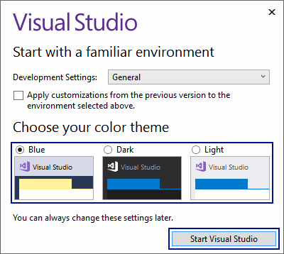
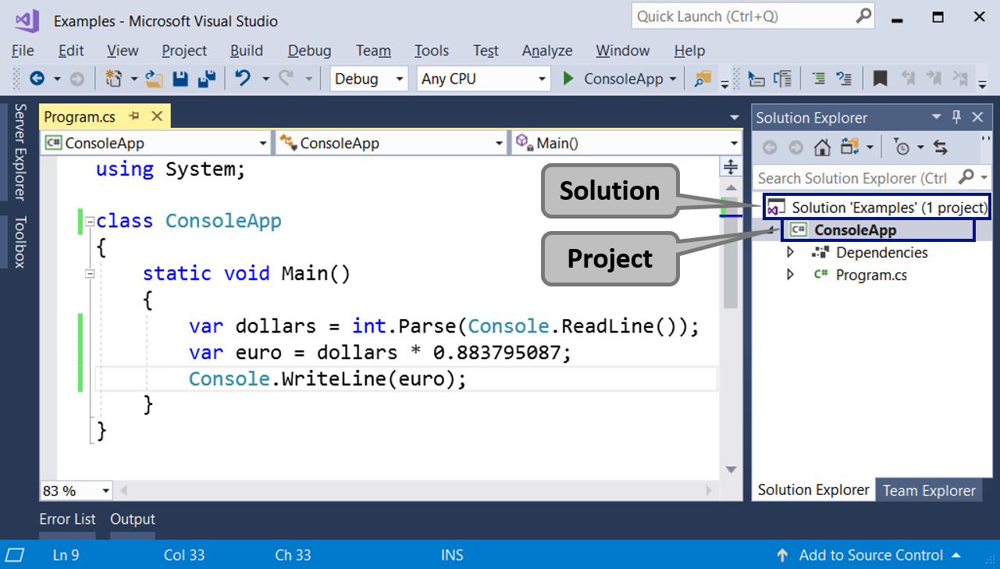

# Visual Studio Hilfestellungen

Hilfestellungen und Tipps für Visual Studio


<!-- .slide: class="left" -->
## Einrichtung

Beim ersten Start:



* Einloggen mit Account (wenn Account besteht)
* Entwicklungseinstellungen: C#
* Farbschema wählen (Empfehlung: Light)
* Start Visual Studio

<!-- .slide: class="left" -->
## Project Solutions and Projects




<!-- .slide: class="left" -->
**Visual Studio Project** repräsentiert "das Projekt", an dem wir arbeiten. Am Anfang werden dies unsere Konsolenanwendungen sein, die wir mit Hilfe der Übungen schreiben lernen werden. Mit tieferem Lernen, Zeit und Übung werden sich diese Projekte in Richtung Desktop-Anwendungen, Web-Anwendungen und andere Entwicklungen bewegen. 
Ein Projekt in VS gruppiert logisch mehrere Dateien, die eine bestimmte Anwendung oder eine Komponente aufbauen. Ein C#-Projekt enthält eine oder mehrere C#-Quelldateien, Konfigurationsdateien und andere Ressourcen. In jeder C#-Quelldatei gibt es eine oder mehrere Definitionen von Typen (Klassen oder andere Definitionen). In den Klassen gibt es Methoden (Aktionen), und sie enthalten eine Folge von Befehlen.


<!-- .slide: class="left" -->
**Visual Studio Solution** stellt einen Container (eine Arbeitslösung) dar, in dem Projekte logisch gebunden sind. Der Zweck der Bindung dieser VS-Projekte besteht darin, eine Möglichkeit zu schaffen, dass der Code aus einem der Projekte mit dem Code aus den übrigen VS-Projekten zusammenarbeitet, um sicherzustellen, dass die Anwendung oder die Website korrekt funktioniert. Wenn das von uns entwickelte Softwareprodukt oder die Dienstleistung groß ist, wird es als VS-Lösung erstellt, und diese Lösung wird in Projekte (VS-Projekte) aufgeteilt, und innerhalb jedes Projekts gibt es Ordner mit Quelldateien.


<!-- .slide: class="left" -->
## Erstes Konsolenprojekt erstellen

* Neues Projekt erstellen → Konsole-App (.NET Framework)
* aussagekräftigen Namen vergeben
* Speicherort festlegen
* Visual Studio erstellt ein leeres C\# Programm


<!-- .slide: class="left" -->
## Debugging

Debugging ist der Prozess des "Anhängens" an die Programmausführung, der es uns erlaubt, den Prozess Schritt für Schritt zu verfolgen. Wir können Zeile für Zeile verfolgen, was in unserem Programm geschieht, welchen Weg es folgt, wie die Werte der definierten Variablen bei jedem Schritt der Fehlersuche sind und viele andere Dinge, die es uns ermöglichen, Fehler (Bugs) zu erkennen.


<!-- .slide: class="left" -->
### Debugging nutzen

* Zeile markieren und Breakpoint (Punkt an welchem das Programm stoppen soll) setzen. F9 oder mit der Maus.
* Programm mit Debugger starten (F5)
* Mit F10 kann mit einzelnen Schritten der Code debuggt werden


<!-- .slide: class="left" -->
### Debugging Shortcuts

* F11 Einzelschritt  
* F10 Prozedurschritt (Methoden werden übersprungen)
* F9 Setzt oder entfernt einen Breakpoint auf der aktuellen Zeile
* Auto und Local: Variablenüberwachung
* Breakpoints (mit Trefferanzahl oder Bedingung)
* Ansicht &rarr; Fehlerliste

Note: Debugging zeigen in VS
Breakpoints, bedingte Breakpoints, Einzelschritte ..., Fenster welches die Werte der Variablen anzeigt, Werte beim Debugging anzeigen.

<!-- .slide: class="left" -->
## Allgemein

[Zeichen in IntelliSense Liste](https://msdn.microsoft.com/de-de/library/y47ychfe.aspx)

[Schlüsselworte in C#](https://docs.microsoft.com/de-de/dotnet/csharp/language-reference/keywords/)

Lesezeichen: STRG + B gefolgt von T oder Symbol (bzw Bearbeiten &rarr; Lesezeichen)

Code formatieren: Bearbeiten &rarr; Erweitert &rarr; Dokument formatieren


<!-- .slide: class="left" -->
### Shortcuts

* F4 - Auf die Eigenschaften wechseln
* F5 - Startet das Startprojekt mit Debugger
* CRTL-F5 - Fürt den Code ohne Debugger aus. (Konsolenfenster bleibt mit der Aufforderung "Press any key to continue" offen)
* F7 - von GUI in die Code-Bind Datei springen
* F9 - Breakpoint setzen/entfernen
* F12 - Gehe zur Definition
* Strg + Mausrad drehen - Code vergrößernMarkdown Preview

[weitere Shortcuts](https://www.dofactory.com/reference/visual-studio-shortcuts)

<!-- .slide: class="left" -->
### Codeblöcke Kennzeichnen bzw. zusammenfassen

```csharp
#region Kommentar bzw Name

CODE

#endregion
```


<!-- .slide: class="left" -->
### Extra DLL mit Dokumentation (XML) einbinden 

Die XML Kommentardatei muss dort liegen wo die eingebundene DLL liegt (mit gleichem Name). Nur dann kann ist die Dokumentation in IntelliSense verfügbar. Neustart von Visual Studio ist nötig.


<!-- .slide: class="left" -->
### Programmierlayout auf C# ändern

Extras &rarr; Einstellungen importieren/exportieren &rarr; Ausgewählte Umgebungseinstellungen importieren &rarr; Nein, neue Einstellungen importieren und aktuelle Einstellungen überschreiben &rarr; Visual C#


<!-- .slide: class="left" -->
### Klassendiagramm erstellen


<!-- .slide: class="left" -->
## Using Verweise

Fehlende Using Verweise automatisch aufnehmen


Oder über Smarttag


<!-- .slide: class="left" -->
## Codeausschnitte / Codevorlagen

Bezeichnung + Tab + Tab oder Rechtsklick &rarr; Ausschnitt einfügen
* if
* mbox
* for
* switch
* cw
* try

Codeausschnitte bearbeiten unter: Extras &rarr; Codeausschnitt-Manager

### Beispiel bei Switch

Switch + Tab + Tab &rarr; Name der Enum Variable Enter + Enter &rarr; nun wird automatisch ein switch case Konstrukt erstellt welches die Enum Elemente beinhaltet.


<!-- .slide: class="left" -->
## Refactoring (Restrukturierung)

### Methoden automatisch erstellen lassen

Name der Methode an der Stelle schreiben wo sie benutzt werden soll.


<!-- .slide: class="left" -->
### Methode umbenennen


<!-- .slide: class="left" -->
### Property

Automatisch erstellen mit „Bearbeiten“ &rarr; Feld kapseln


```csharp
private string name;

public string Name
{
    get { return = name; }
    set { name = value; }
}
```

Oder als Auto Property

```csharp
public string Name { get; set; }
```
