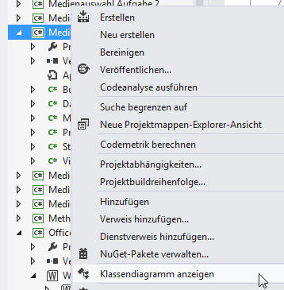
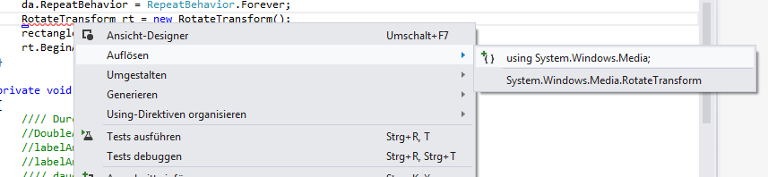
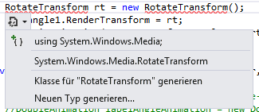

# Visual Studio Hilfestellungen

Hilfestellungen und Tipps für Visual Studio


<!-- .slide: class="left" -->
## Allgemein

[Zeichen in IntelliSense Liste](https://msdn.microsoft.com/de-de/library/y47ychfe.aspx)

[Schlüsselworte in C#](https://docs.microsoft.com/de-de/dotnet/csharp/language-reference/keywords/)

Lesezeichen: STRG + B gefolgt von T oder Symbol (bzw Bearbeiten &rarr; Lesezeichen)

Code formatieren: Bearbeiten &rarr; Erweitert &rarr; Dokument formatieren


<!-- .slide: class="left" -->
### Shortcuts

* F4 Auf die Eigenschaften wechseln
* F5 Debugger starten
* F7 von GUI in die Code-Bind Datei springen
* F9 Breakpoint setzen/entfernen
* F12 Gehe zur Definition
* Strg + Mausrad drehen Code vergrößernMarkdown Preview


<!-- .slide: class="left" -->
### Codeblöcke Kennzeichnen bzw. zusammenfassen

```csharp
#region Kommentar bzw Name

CODE

#endregion
```


<!-- .slide: class="left" -->
### Extra DLL mit Dokumentation (XML) einbinden 

Die XML Kommentardatei muss dort liegen wo die eingebundene DLL liegt (mit gleichem Name). Nur dann kann ist die Dokumentation in IntelliSense verfügbar. Neustart von Visual Studio ist nötig.


<!-- .slide: class="left" -->
### Programmierlayout auf C# ändern
Extras &rarr; Einstellungen importieren/exportieren &rarr; Ausgewählte Umgebungseinstellungen importieren &rarr; Nein, neue Einstellungen importieren und aktuelle Einstellungen überschreiben &rarr; Visual C#


<!-- .slide: class="left" -->
### Klassendiagramm erstellen




<!-- .slide: class="left" -->
## Using Verweise

Fehlende Using Verweise automatisch aufnehmen



Oder über Smarttag




<!-- .slide: class="left" -->
## Codeausschnitte / Codevorlagen
Bezeichnung + Tab + Tab oder Rechtsklick &rarr; Ausschnitt einfügen
* if
* mbox
* for
* switch
* cw
* try

Codeausschnitte bearbeiten unter: Extras &rarr; Codeausschnitt-Manager

### Beispiel bei Switch
Switch + Tab + Tab &rarr; Name der Enum Variable Enter + Enter &rarr; nun wird automatisch ein switch case Konstrukt erstellt welches die Enum Elemente beinhaltet.


<!-- .slide: class="left" -->
## Refactoring (Restrukturierung)

### Methoden automatisch erstellen lassen

Name der Methode an der Stelle schreiben wo sie benutzt werden soll.


<!-- .slide: class="left" -->
### Methode umbenennen


<!-- .slide: class="left" -->
### Property

Automatisch erstellen mit „Bearbeiten“ &rarr; Feld kapseln


```csharp
private string name;

public string Name
{
    get { return = name; }
    set { name = value; }
}
```

Oder als Auto Property

```csharp
public string Name { get; set; }
```


<!-- .slide: class="left" -->
## Debugger

* F11 Einzelschritt  
* F10 Prozedurschritt (Methoden werden übersprungen)
* Auto und Local: Variablenüberwachung
* Breakpoints (mit Trefferanzahl oder Bedingung)
* Ansicht &rarr; Fehlerliste
