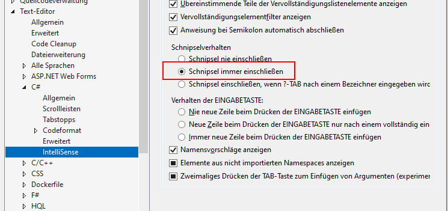
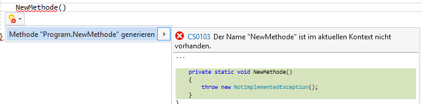
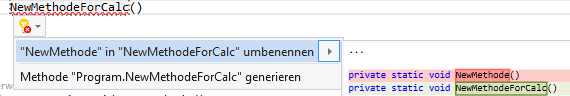
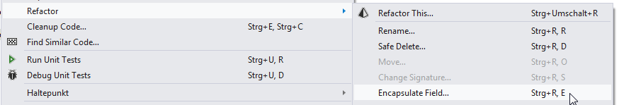
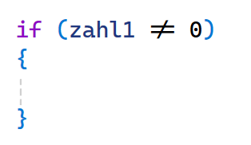

# Visual Studio Hilfestellungen

Hilfestellungen und Tipps für Visual Studio

---

<!-- .slide: class="left" -->
## Projekt und Solution


---

<!-- .slide: class="left" -->
**Visual Studio Project** repräsentiert "das Projekt", an dem wir arbeiten. Dies kann eine Konsolen-Anwendungen, eine Desktop-Anwendungen, eine Web-Anwendungen oder auch eine Bibliothek sein. 
Ein Projekt in VS beinhaltet mehrere Dateien, die eine bestimmte Anwendung oder eine Komponente aufbauen. Ein C#-Projekt enthält eine oder mehrere C#-Quelldateien, Konfigurationsdateien und andere Ressourcen.

---

<!-- .slide: class="left" -->
**Visual Studio Solution** stellt einen Container dar, in dem Projekte zusammengefasst sind. Dies kann bei größeren Anwendungen hilfreich sein, da diese meiste aus mehreren Projekten bestehen.

Dadurch hat man die Möglichkeit z.B. gemeinsam genutzten Code in ein eigenes Projekt zu verschieben.

---

<!-- .slide: class="left" -->
## Debugging

Beim Debugging geht es darum, Fehler im Code zu finden und zu beheben.

Im Detail bedeutet Debugging:

1. Fehler finden: Du überprüfst den Code Schritt für Schritt, um die Stelle zu finden, an der etwas nicht wie erwartet funktioniert.
   
2. Verstehen, was passiert: Beim Debuggen kannst du den Programmablauf verfolgen, Variablenwerte überprüfen und so verstehen, warum ein Fehler auftritt.
   
3. Fehler beheben: Nachdem der Fehler gefunden wurde, änderst du den Code, um das Problem zu lösen.

---

<!-- .slide: class="left" -->
### Debugging nutzen

Es gibt Tools wie **Breakpoints**, die das Programm an bestimmten Stellen anhalten, damit du es genauer untersuchen kannst.

* Zeile markieren und Breakpoint setzen. F9 oder Klick mit der Maus.
* Programm mit Debugger starten (F5)
* Mit F11 kann mit einzelnen Schritten der Code durchlaufen werden

Note: 
Debugging zeigen in **VS**
* Breakpoints
* bedingte Breakpoints
* Einzelschritte 
* Fenster welches die Werte der Variablen anzeigt
* Werte beim Debugging anzeigen.
* Ansicht &rarr; Fehlerliste

---

<!-- .slide: class="left" -->
### Shortcuts

* F4 - Auf die Eigenschaften wechseln
* F5 - Startet das Startprojekt mit Debugger
* CRTL-F5 - Führt den Code ohne Debugger aus
* F7 - von GUI in die Code-Bind Datei springen
* F9 - Breakpoint setzen/entfernen
* F10 Prozedurschritt beim debuggen (Methoden werden übersprungen)
* F11 Einzelschritt beim debuggen 
* F12 - Gehe zur Definition
* Strg + Mausrad drehen - Code vergrößern

[weitere Shortcuts](https://www.dofactory.com/reference/visual-studio-shortcuts)

---

<!-- .slide: class="left" -->
### Programmierlayout auf C# ändern

Extras &rarr; Einstellungen importieren/exportieren &rarr; Ausgewählte Umgebungseinstellungen importieren &rarr; Nein, neue Einstellungen importieren und aktuelle Einstellungen überschreiben &rarr; Visual C#

---

<!-- .slide: class="left" -->
### Klassendiagramm erstellen

Ist ein extra Feature das in Visual Studio 2022 installiert werden muss.


---

<!-- .slide: class="left" -->
## Using Verweise

Fehlende Using Verweise automatisch aufnehmen


Oder über Smarttag


---

<!-- .slide: class="left" -->
## Codeschnipsel / Codevorlagen



---

<!-- .slide: class="left" -->
### Codeschnipsel / Codevorlagen verwenden

Bezeichnung + Tab + Tab oder Rechtsklick &rarr; Ausschnitt einfügen
* if
* mbox
* for
* switch
* cw
* try

Codeschnipsel bearbeiten unter: Extras(Tools) &rarr; Codeschnipsel-Manager

### Beispiel bei Switch

Switch + Tab + Tab &rarr; Name der Enum Variable Enter + Enter &rarr; nun wird automatisch ein switch case Konstrukt erstellt welches die Enum Elemente beinhaltet.

---

<!-- .slide: class="left" -->
## Refactoring (Restrukturierung)

### Methoden automatisch erstellen lassen

Name der Methode an der Stelle schreiben wo sie benutzt werden soll.



---

<!-- .slide: class="left" -->
### Methode umbenennen



---

<!-- .slide: class="left" -->
### Property

Automatisch erstellen mit „Bearbeiten“ &rarr; Feld kapseln



```csharp []
private string name;

public string Name
{
    get { return = name; }
    set { name = value; }
}
```

Oder als Auto Property

```csharp []
public string Name { get; set; }
```

---

<!-- .slide: class="left" -->
### Ligatures (Buchstabenverbindungen)



Diese andere Anzeige wird automatisch durch die augewählte Schriftart gemacht z.B. "Cascadia Code".
Wenn man dies nicht haben möchte muss die Schriftart ändern auf z.B. "Cascadia Mono" oder "Consolas"

Tools -> Options -> Environment -> Fonts and Colors