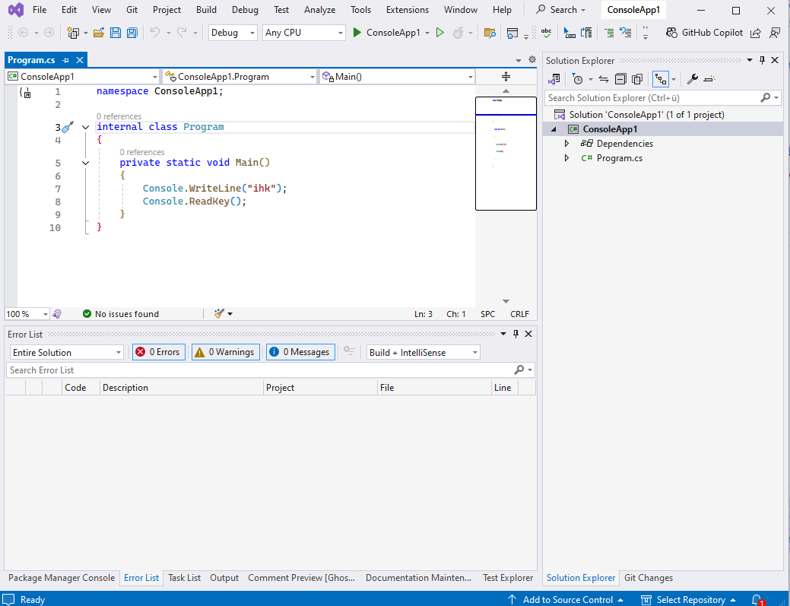
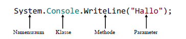
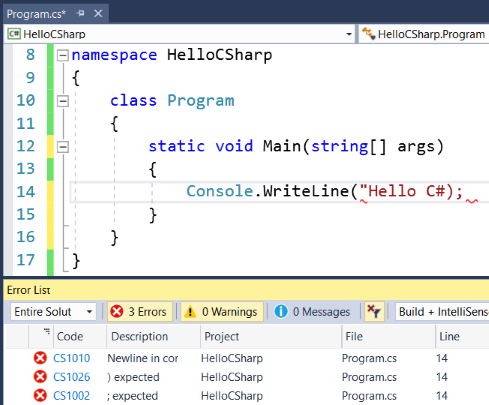

# C# Grundlagen

Grundlagen, Programmaufbau, Codekonventionen, Kommentare und häufige Fehler.

---

<!-- .slide: class="left" -->
## C Sharp

* C\# (gesprochen "C Sharp") wurde bei Microsoft von Anders Hejlsberg 2001 entwickelt.

* Die aktuellste Version C\# 13 wurde 2024 mit Microsoft .NET 9 veröffentlicht.

* Die Programmiersprache ist voll objektorientiert und beinhaltet verschiedene Elemente aus den Sprachen C, C++, Java, Pascal und Basic.

* C\# wurde wie Java auf Hardwareunabhängigkeit entwickelt

---

<!-- .slide: class="left" -->
## Entwicklungsumgebungen

Zur Erstellung eines C\# Programms wird eine Entwicklungsumgebung (IDE - Integrated Development Environment) benötigt.

* [Visual Studio](https://visualstudio.microsoft.com/de/)
* [JetBrains Raider](https://www.jetbrains.com/de-de/rider/)
* [Visual Studio Code](https://code.visualstudio.com/)
* [Mono Develop](https://www.monodevelop.com/)

---

<!-- .slide: class="left" -->
### Visual Studio



Note: 
* Öffnen von Visual Studio Community + Registrierung
* neues Projekt
* Visual Studio Aufbau erklären
* eventuell Einstellungen vornehmen

---

<!-- .slide: class="left" -->
## Programmaufbau

```csharp []
using System; // Assemblies einbinden (Klassen aus dem System Namespace nutzen).

namespace Firma.User; //Projektteile werden in Namensräumen (Containern) zusammengefasst.

internal class Program // Bauplan für Abbildung von Objekten. Alles muss in einer Klasse laufen.
{
    static void Main(string[] args) // Einstiegspunkt mit Parameter Array.
    {
        Console.WriteLine("IHK"); // String Wert in der Console ausgeben.
    }
} // Ende der Klasse.
```

[Allgemeine Struktur eines C# Programmes](https://learn.microsoft.com/de-de/dotnet/csharp/fundamentals/program-structure/).
Mehr zu [Main-Methode](https://learn.microsoft.com/de-de/dotnet/csharp/fundamentals/program-structure/main-command-line).

Note: 
* Static kann ausgeführt werden ohne Instanz einer Klasse. Daraus können selbst nur statische Methoden aufgerufen werden.
* Alle Zeilen werden mit Strichpunkt abgeschlossen.
* Jeder Block ist eingefasst in {}

In **VS** zeigen wie ein neues Projekt erstellt wird (.NET Konsole ohne Top Level Statements).
Programm ausführen (Übung dazu folgt).

AOT: schnellerer Start, benötigen keine .Net Runtime.

---

<!-- .slide: class="left" -->
## Top-Level Anweisung

Seit C# 9 ist eine `Main`-Methode nicht mehr notwendig. Es können [Top-Level Anweisungen](https://docs.microsoft.com/de-de/dotnet/csharp/fundamentals/program-structure/top-level-statements) verwendet werden um den Code zu minimieren.

```csharp
Console.WriteLine("IHK"); 
```

Note: 
* Beispiel zeigen in **VS** 2022 mit der neuen Vorlage (.Net 8)
* `Main`-Methode muss nicht mehr explizit erstellt werden.
* Neu erstellen (builden)
* Erstellte Ordner
* Debug und Release Build (Ordner)

---

<!-- .slide: class="left" -->
## Namensräume

* Klassen und Methoden können in sogenannten Namensräumen (engl. Namespaces) hierarchisch geordnet werden.



* Damit auf Klassen eines [Namensraums](https://docs.microsoft.com/de-de/dotnet/csharp/programming-guide/namespaces/using-namespaces) zugegriffen werden kann, muss ein Verweis auf den Namensraum bestehen.

* Ein Namespace wird mit `using` eingebunden

```csharp
using System;
```

---

<!-- .slide: class="left" -->
## Codekonventionen: Namensgebung

* **aussagekräftige Namen** verwenden
* Es sind nur Buchstaben erlaubt, keine Zahlen oder Sonderzeichen.
* Pascal-Schreibweise (jeden Anfangsbuchstaben eines Wortes groß)
    * bei Klassen- und Methodennamen
    * z.B.: `WriteToErrorLog()`
* Camel-Schreibweise (jeden Anfangsbuchstaben eines Wortes groß, außer beim ersten Wort)
    * bei Variablen
    * z.B.: `string exportFilePath`
* Mehr zum Thema [Namenskonvention](https://docs.microsoft.com/de-de/dotnet/standard/design-guidelines/naming-guidelines)

---

<!-- .slide: class="left" -->
## Codekonventionen

* Einrückungen immer nur per `Tab` (4 Zeichen) nicht mit Leerzeichen
* ein Namespace und eine Klasse pro Datei
* nur eine Variable auf einmal deklarieren
* nicht selbsterklärende Stellen im Code kommentieren
* zum Kommentieren innerhalb eines Codeblocks nicht /\* \...\*/ benutzen sondern // oder ///

---

<!-- .slide: class="left" -->
## XML-Kommentare

* Durch die Verwendung von XML-Tags kann der Code kommentiert und diese Kommentare auch mit Intelli-Sense angezeigt werden.
* Ein Export zu Dokumentationszwecken ist möglich.
* Das Grundgerüst wird automatisch generiert.
* Mehr zum Thema [XML-Kommentare](https://docs.microsoft.com/de-de/dotnet/csharp/programming-guide/xmldoc/xml-documentation-comments)

```csharp
/// <summary>
/// Beschreibung der Methode
/// </summary>
/// <param name="args">Parameter beschreiben</param>
/// <returns>Return Wert beschreiben</returns>
```

---

<!-- .slide: class="left" -->
## TODO Kommentare

Es können Aufgaben markiert werden, welche später erledigt werden sollen.
Visual Studio bietet dafür eine extra Ansicht wo alle [TODO's](https://docs.microsoft.com/de-de/visualstudio/ide/using-the-task-list?view=vs-2022) aufgeführt werden.

```csharp
// TODO: Name anpassen
string abcdef = string.Empty;
```

Außerdem gibt es weitere Kommentar Arten wie z.B.:

* UNDONE
* HACK
* UnresolvedMergeConflict

Note: In **VS** zeigen

* Kommentare, XML Kommentare und TODO's
* Es können eigene Task Kommentare erstellt werden Evironment --> Task List
* Codevervollständigung
* Intelli-Sense

---

<!-- .slide: class="left" -->
## Datentypen in C# Teil 1

### Teil 1

| Datentyp  | Größe        | Beschreibung  |
| ------------- |-------------| -----|
| bool      | 1 Bit             | true (1) oder false (0) |
| byte      | 8 Bit    | Zahlen von 0 bis 255  |
| sbyte     | 8 Bit     | Zahlen mit Vorzeichen von -128 - 127    |
| char      | 16 Bit           | Speichert ein einzelnes Zeichen/Buchstabe |
| float     | 32 Bit  | Speichert Kommazahlen mit 6 bis 9 Stellen (-3.402823E38 bis +3.402823E38)   |
| double    | 64 bit  | Speichert Kommazahlen mit 15 Stellen (–1,79769313486232E308 bis +1,79769313486232E308)    |
| decimal   | 128 Bit  | Zahl mit Dezimalstellen 29 Stellen (–7,922816E28 bis +7,922816E28)    |


Note: Welchen Wert z.B. eine Variable annehmen/speichern kann.

---

<!-- .slide: class="left" -->
### Teil 2

| Datentyp  | Größe        | Beschreibung  |
| ----------|--------------| --------------|
| int       | 32 Bit  | Ganze Zahlen von -2 147 483 648 bis 2 147 483 647    |
| long      | 64 Bit  | Ganze Zahlen von -9,223,372,036,854,775,808 bis 9,223,372,036,854,775,807    |
| ulong     | 64 Bit  | 0 bis 18.446.744.073.709.551.615    |
| object    | 32 Bit   | kann auf Daten eines beliebigen Datentyps verweisen    | 
| short     | 16 Bit  | Ganzzahlen mit Vorzeichen von –32.768 bis 32.767    |
| ushort    | 16 Bit  | Ganzzahlen ohne Vorzeichen von 0 bis 65.535    |
| string    | 16 Bit | Speichert eine Zeichenfolge   |

Mehr zum Thema [Datentypen](https://docs.microsoft.com/de-de/dotnet/csharp/language-reference/builtin-types/built-in-types)

---

<!-- .slide: class="left" -->
### Booleans

Der `bool` Datentyp wird genutzt wenn nur zwei Werte möglich sind. z.B. Ja/nein, An/Aus oder Wahr/Falsch.

```csharp
bool isOpen = true;
Console.WriteLine(isOpen);  // Ausgabe: True
```

Üblicher ist es jedoch, boolesche Werte aus booleschen Ausdrücken zurückzugeben, um bedingte Tests durchzuführen.

```csharp
Console.WriteLine(10 > 9); // Ausgabe True, weil 10 größer ist wie 9
```

Der boolesche Wert eines Ausdrucks ist die Grundlage für alle Vergleiche und Bedingungen in C#.

---

<!-- .slide: class="left" -->
## Ein- und Ausgabe in der Konsole

Einige wichtige Methoden zur Ein- und Ausgabe gehören zur Klasse [Console](https://learn.microsoft.com/de-de/dotnet/api/system.console?view=net-8.0) im Namespace System. Sie lauten:

| Methode      | Beschreibung
| -------------|-------------|
| `Clear()`     | Konsolenfenster leeren
| `ReadLine()` | Liest eine Zeile als String von der Konsole.
| `Write()`    | Gibt einen String auf der Konsole ohne Zeilenumbruch aus.
| `WriteLine()`| Entspricht Write() nur mit Zeilenumbruch.

Note:
* Zeigen Wert von Konsole in Variable speichern `ReadLine` 
* `ReadKey` damit Konsole offen bleibt

---

## Beispiel

```csharp
Console.Write("I");
Console.Write("H");
Console.Write("K");
// Ausgabe: IHK

Console.Write("\n");
Console.WriteLine("IHK");
// Ausgabe: IHK
``` 

Note: 
* cw + Tab + Tab
* Sollte dies nicht funktionieren aktivieren unter (Optionen --> Texteditor --> C# --> IntelliSense --> Schnippsel immer einschließen)

---

<!-- .slide: class="left" -->
## Übung 1

Erstelle ein neues .Net Konsolen-Projekt. Dieses soll in der Console:

```bash
Hallo IHK ULM
```

ausgeben.
Erst bei einem Tastendruck soll sich das Konsolenfenster schließen.

Note: `Console.ReadKey();`

---

<!-- .slide: class="left" -->
## Übung 1.1

Erstelle ein neues .Net Konsolen-Projekt. Dieses soll in der Console nach deinem Vornamen und Nachnamen fragen. Beide Werte müssen dann eingegeben werden. Am Ende wird der Name komplett ausgegeben.

Zum Beispiel:

```bash
Wie ist dein Vorname?
'Andreas'
Wie ist dein Nachname?
'Blersch'
Dein Name ist: 'Andreas Blersch'
```

Erst bei einem Tastendruck soll sich das Konsolenfenster schließen.

---

<!-- .slide: class="left" -->
## Typische Fehler

### Schreiben von Code außerhalb der Main Method

Einer der häufigsten Fehler bei Anfängern ist **Schreiben außerhalb des Blocks der `Main()` Methode**. Dadurch kann die Entwicklungsumgebung oder der Compiler die angegebenen Befehle im Programm nicht richtig lesen.

```csharp
static void Main(string[] args)
{
}
Console.WriteLine("Hello C#");
```

---

<!-- .slide: class="left" -->
### Falsche Großschreibung

Ein weiterer Fehler ist das Vertauschen von **Groß- und Kleinbuchstaben**. Diese sind jedoch für den Aufruf der Befehle und deren korrekter Funktion von Bedeutung.

```csharp
static void Main(string[] args)
{
    Console.Writeline("Hello C#");
}
```

Im obigen Beispiel ist `Writeline` falsch geschrieben und muss auf `WriteLine` korrigiert werden.

---

<!-- .slide: class="left" -->
### Fehlende Semikolon

Das Fehlen von **einem Semikolon** \(`;`\) am Ende der Befehle ist eines der meisten Fehler bei Programmieranfänger. Das Überspringen dieses Zeichens führt zu einer **Fehlfunktion des Programms**.

```csharp
static void Main(string[] args)
{
    Console.WriteLine("Hello C#")
}
```

---

<!-- .slide: class="left" -->
### Fehlende oder falsche Anführungszeichen oder Klammern

Das Fehlen von **Anführungszeichen** oder **das Fehlen von öffnenden oder schließenden Klammern** kann sich ebenfalls als Problem erweisen. Wie beim Semikolon führt auch hier das Problem zu einer **Fehlfunktion des Programms** oder insgesamt zu dessen Ausfall. Dieser Fehler macht sich bei größerem Code kaum bemerkbar.

```csharp
static void Main(string[] args)
{
    Console.WriteLine("Hello C#);
}
```

---

<!-- .slide: class="left" -->
Dieses Programm wirft **einen Kompilierzeitfehler** und der Build wird fehlschlagen. Der fehlerhafte Code wird sogar unterstrichen, um den Programmierer auf den Fehler hinzuweisen, den er gemacht hat \(das fehlende schließende Anführungszeichen\):



---

<!-- .slide: class="left" -->
Ein weiteres Beispiel ist das Fehlen von `{` oder `}`. Es kann zu unerwarteten Fehlermeldungen führen, die nicht immer leicht zu verstehen sind.

```csharp
class Example
{
    static void Main(string[] args)
    {
        Console.WriteLine("Hello C#);
}
```