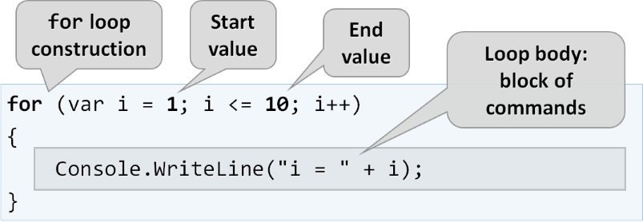

# Kontrollstrukturen

Durch [Kontrollstrukturen](https://docs.microsoft.com/en-us/dotnet/csharp/language-reference/keywords/selection-statements) sind wir in der Lage, Programme nicht nur sequentiell, also Zeile für Zeile, ablaufen zu lassen sondern wir haben die
Möglichkeit Programme sinnvoll zu strukturieren und zu steuern.

---

<!-- .slide: class="left" -->
## If-Anweisung

Mit der `if`-Anweisung lässt sich ein Codeblock definieren der nur ausgeführt wird wenn die Bedingung `true` ist.

```csharp
if (condition)
{
    // Codeblock der ausgeführt wird wenn die Bedinung true ist. 
}
```

```csharp
if (1 < 5)
{
    Console.WriteLine("1 ist kleiner als 5.");
}

```

---

<!-- .slide: class="left" -->
## Else-Anweisung

Zusätzlich zur `if`-Anweisung lässt sich ein `else`-Block definieren. Dieser wird ausgeführt wenn die Bedingung `false` ist.

```csharp []
if (condition)
{
    // Codeblock der ausgeführt wird wenn die Bedinung true ist. 
}
else 
{
    // Codeblock der ausgeführt wird wenn die Bedinung false ist.
}

```

```csharp []
var testValue = 50;
string text;

if (testValue == 50)
{
    text = "Bedingung erfüllt";
}
else  
{
    text = "Bedingung nicht erfüllt"
}
```

---

<!-- .slide: class="left" -->
## Else-if-Anweisung

Es lassen sich weitere `else if` Blöcke verketten wenn eine weitere Bedingung geprüft und anderst darauf reagiert werden soll.

```csharp []
var temperature = 10;
string text;

if (temperature == 20)
{
    text = "Temperatur erreicht";
}
else if (temperature > 20)  
{
    text = "Temperatur ist zu hoch";
}
else 
{
    text = "Temperatur ist zu niedrig";
}
```

Mehr zum Thema [If](https://docs.microsoft.com/de-de/dotnet/csharp/language-reference/statements/selection-statements#the-if-statemente)

Note: 
* if(else) + tab + tab. 
* If ist natürlich auch mit mehreren If Zweigen erweiter- oder/und verschachtelbar.

---

<!-- .slide: class="left" -->
## Bedingungsoperator (Frageoperator)

Oft auch als kurzes `if else` bezeichnet. Es kann verwendet werden, um mehrere Codezeilen durch eine einzige Zeile zu ersetzen.
Liefert immer einen Ausdruck bzw. eine Wertzuweisung: **?:**

```csharp
Variable = (Bedingung) ? expressionTrue :  expressionFalse;
```

```csharp
var text = (testValue == 50) ? "erfüllt" : "nicht erfüllt";
```

Mehr zum [Bedingungsoperator](https://docs.microsoft.com/de-de/dotnet/csharp/language-reference/operators/conditional-operator) 

---

<!-- .slide: class="left" -->
## Switch-Anweisung

Bei der `Switch`-Anweisung wird der Ausdruck in der Anweisung ausgewertet und in Abhängigkeit des ganzzahligen Ausdrucks zum entsprechenden `case` gesprungen.

```csharp []
int caseSwitch = 1;
switch (caseSwitch)
{
    case 1:
        Console.WriteLine("Case 1");
        break; // Beendet die Switch Ausführung
    case 2:
        Console.WriteLine("Case 2");
        break;
    case > 2:
        Console.WriteLine("Case 3");
        break;
    default: // Optional, wird ausgeführt wenn kein Case Fall zutrifft
        Console.WriteLine("Default case");
        break;
}
```

Note: 
* switch + tab + tab
* Es sind auch weitere Musterabgleiche möglich.

---

<!-- .slide: class="left" -->
C\# erlaubt auch **Strings** als Switch-Variable:

```csharp []
var stadt = "Stuttgart";
switch (stadt)
{
   case "Ulm":
        Console.WriteLine("Case 1");
        break;
    case "Stuttgart":
        Console.WriteLine("Case 2");
        break;
    default:
        Console.WriteLine("Default case");
        break;
}
```

Mehr zum Thema [Switch](https://docs.microsoft.com/de-de/dotnet/csharp/language-reference/statements/selection-statements#the-switch-statement)

---

<!-- .slide: class="left" -->
## Übung 3

1. Erstelle ein .Net Konsolen-Projekt. Es soll eine Zahl eingegeben werden. Es wird überprüft ob die Zahl einem Wochentag entspricht und dann der Name des Wochentags ausgegeben werden.

1 = Montag
2 = Dienstag
...
7 = Sonntag

Wird eine ungültige Zahl eingegeben soll ein Fehlertext ausgegeben werden

2. Bei einem Tag im Wochenende (Samstag und Sonntag) soll die Ausgabe "Wochenende" lauten.

---

<!-- .slide: class="left" -->
## Schleifen (Iterationen)

Bei der Programmierung ist es oft erforderlich, einen Block von Befehlen mehrfach auszuführen.

Schleifen sind praktisch, weil sie Zeit sparen, Fehler reduzieren und den Code besser lesbar machen.

---

<!-- .slide: class="left" -->
### While-Schleife

`While`-Schleifen können einen Codeblock so lange ausführen, bis eine bestimmte Bedingung ```true``` ist. Der Ausdruck wird vor jeder Ausführung geprüft.

```csharp []
int i = 0;
while (i < 99 )
{
    Console.WriteLine("i hat den Wert: " + i);
    i++;
}
```

Mehr zum Thema [While-Schleifen](https://docs.microsoft.com/de-de/dotnet/csharp/language-reference/statements/iteration-statements#the-while-statement)

Note: Nicht vergessen die Variable zu erhöhen. Sonst endet die Schleife nie. 

---

<!-- .slide: class="left" -->
### Do-While-Schleife

Die `do/while`-Schleife ist eine Variante der `while`-Schleife. Diese Schleife führt den Codeblock einmal aus, bevor sie prüft, ob die Bedingung `true` ist, und wiederholt dann die Schleife, solange die Bedingung `true` ist.

```csharp []
int i = 0;
do
{
    Console.WriteLine("i hat den Wert: " + i);
    i++;
}
while (i < 99 );
```

Mehr zum Thema [Do-While-Schleifen](https://docs.microsoft.com/de-de/dotnet/csharp/language-reference/statements/iteration-statements#the-do-statement)

---

<!-- .slide: class="left" -->
### For-Schleife

Wenn Sie genau wissen, wie oft Sie einen Codeblock in einer Schleife durchlaufen wollen, verwenden Sie die `for`-Schleife anstelle einer `while`-Schleife.



---

<!-- .slide: class="left" -->
```csharp []
// i setzen bevor die Schleife beginnt.
// Bedingung die geprüft wird. i muss kleiner 10 sein.
// Erhöht den Schleifenzähler nach jedem Schleifendurchlauf.
for (int i = 0; i < 10; i++ )
{
    // Start bei 0 - 9 (10 Iterationen)
    Console.WriteLine("i hat den Wert: " + i);
}
```

Mehr zum Thema [For-Schleifen](https://docs.microsoft.com/de-de/dotnet/csharp/language-reference/statements/iteration-statements#the-for-statement)

Note: 
* for (aufsteigender Counter) + tab + tab 
* fore (absteigender Counter) + tab + tab
* Für Übung notwendig: `int n = int.Parse(Console.ReadLine());`

---

<!-- .slide: class="left" -->
## Übung 4

1. Erstelle ein .Net Konsolen-Projekt. Dieses fragt einen Zahlenwerte (int) in der Konsole ab.
Nun soll in einer Schleife solange von 1 beginnend immer die nächste Zahl bis zum eingegebenen Wert ausgegeben werden.

Beispiel:

```batch
Bitte eine Zahl eingeben:
'5'
1
2
3
4
5
```

2. Was muss getan werden um vom eingegebenen Zahlenwert bis zur 1 zu kommen?

---

<!-- .slide: class="left" -->
### verschachtelte Schleifen

Eine Schleife kann beliebig verschachtelt werden, d.h. in einer Schleife können wir eine weitere Schleife ausführen.

Ein Quadrat mit n-Zeilen zeichnen, die jeweils n-mal das Zeichen **=-** enthalten:

```csharp []
// Wieviel Schleifendurchläufe
int n = int.Parse(Console.ReadLine());

// Äußere Schleife (erzeugt eine neue Zeile)
for (int row = 1; row <= n; row++)
{
    // Innere Schleife (Schreibt den Inhalt in die Zeile)
    for (int col = 1; col <= n; col++)
    {
        Console.Write("=-");
    }

    // Erzeugt eine neue Zeile
    Console.WriteLine();
}
```

Note: **Übung 4** verschachtelte Schleife

---

<!-- .slide: class="left" -->
### Foreach-Anweisung

Die [foreach-Anweisung](https://docs.microsoft.com/de-de/dotnet/csharp/language-reference/statements/iteration-statements#the-foreach-statementn) kann auf Arrays und für jede Klasse eingesetzt
werden, welche die Schnittstelle `IEnumerable` implementiert. Fehler mit falscher Indexierung sind nicht mehr möglich.

**For Schleife:**

```csharp []
double [] meinArray = new double [] { 1.1, 1.2, 1.3, 1.4, 1.5 };
for(int i=0; i < meinArray.Length; i++)
{
    Console.Write($"{meinArray[i]}\n");
}
```

**Foreach:**

```csharp []
foreach (var meinWert in meinArray)
{
    Console.WriteLine($"{meinWert}\n");
}
```

**Achtung:** Der foreach-Bezeichner "meinWert" ist schreibgeschützt. Er
kann also nicht zur Zuweisung von Array Werten verwendet werden!

Note: 
* foreach + tab + tab
* Sinnvoll wenn alle Werte durchlaufen werden sollen aber kein Index benötigt wird.
* Mit GetEnumerator() kann Index abgerufen und bearbeitet werden.

---

<!-- .slide: class="left" -->
## Sprunganweisungen

### Break und Continue

```csharp []
// Schleife komplett beenden, Execute nie ausführen.
for (int i = 0; i < 10; i++) 
{
    if (i == 0) 
    {
        break;
    }
    Execute("DoSomething");
}
```

```csharp []
// Execute nur beim ersten Durchlauf nicht ausführen.
// Continue beginnt nächste Iteration.
for (int i = 0; i < 10; i++) 
{
    if (i == 0) 
    {
        continue;
    }
    Execute("DoSomething");
}
```

Mehr zum Thema [Sprunganweisungen](https://docs.microsoft.com/de-de/dotnet/csharp/language-reference/keywords/jump-statements)

Note:
* Var
* **ÜBUNG 5** Fakultät


