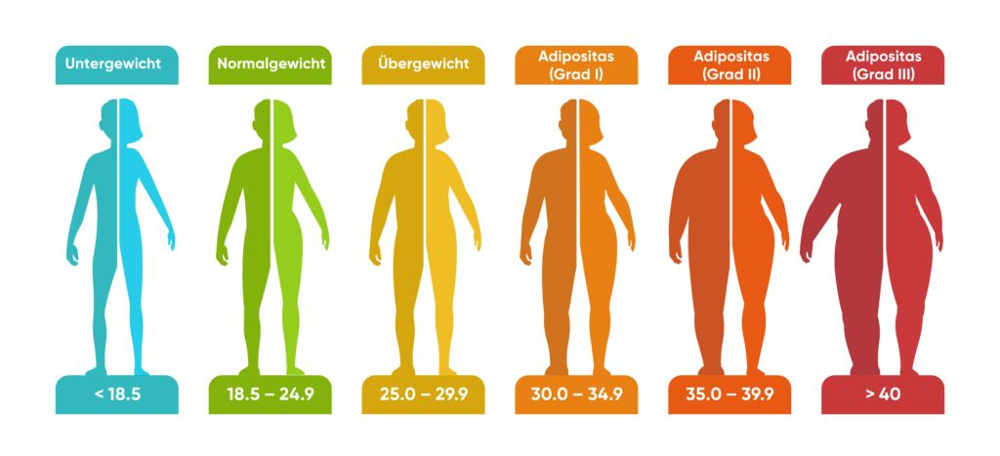

# Übung - BMI

## Aufgabe

Erstellen Sie ein Konsolenprogramm welches den BMI (Body-Mass-Index) berechnet. Der BMI ist eine Kenngröße zur Ermittlung des eigenen Über-/Untergewichtszustandes.
Das Programm gibt den berechneten BMI und die zugehörige Gruppe aus.

### Formel
BMI = Körpergewicht (in kg) / (Körpergröße (in m) * Körpergröße (in m))

### BMI Gruppen

### Bemerkung

* Die Berechnung des BMI soll in einer eigenen Methode erfolgen. Diese gibt den berechneten BMI zurück.
* Eine weitere Methode nimmt den berechneten BMI entgegen und gibt die Bezeichnung der zugehörigen Gruppe zurück.
* Die Ausgabe auf der Konsole erfolgt in einer dritten Methode.
